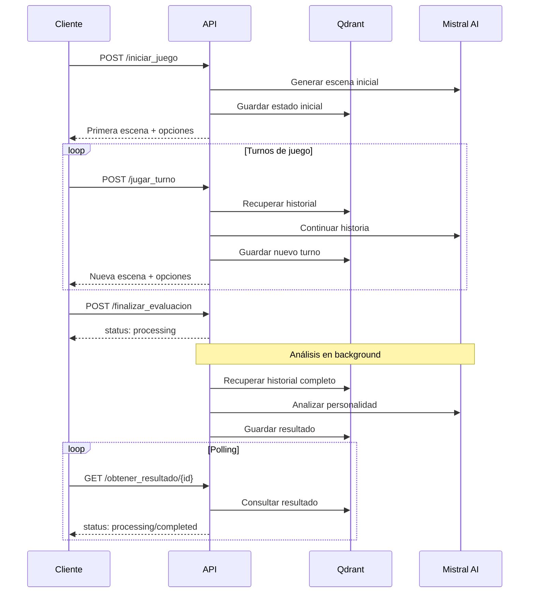

# 📡 API Reference - Test de Personalidad Interactivo

## 🌐 Base URL
```
http://localhost:8000
```

## 🔐 Autenticación
Actualmente no se requiere autenticación. Las API keys de Mistral se manejan en el backend.

## 📋 Endpoints

### 1. Iniciar Juego
Crea una nueva sesión de juego y genera la primera escena narrativa.

```http
POST /iniciar_juego
```

#### Request Body
```json
{
  "nombre": "string",
  "arquetipo_inicial": "string"
}
```

#### Parámetros
| Campo | Tipo | Requerido | Descripción |
|-------|------|-----------|-------------|
| `nombre` | string | ✅ | Nombre del jugador |
| `arquetipo_inicial` | string | ✅ | Arquetipo seleccionado (ej: "Explorador", "Sabio") |

#### Response (200 OK)
```json
{
  "game_id": "550e8400-e29b-41d4-a716-446655440000",
  "descripcion_escena": "Como un Explorador, te encuentras ante un mapa antiguo...",
  "opciones": [
    {
      "accion": "Seguir la ruta más directa",
      "faceta": "pragmatismo"
    },
    {
      "accion": "Explorar las zonas sin marcar del mapa",
      "faceta": "curiosidad"
    },
    {
      "accion": "Consultar con otros viajeros",
      "faceta": "colaboracion"
    },
    {
      "accion": "Estudiar el mapa detenidamente",
      "faceta": "analisis"
    }
  ],
  "palabra_simbolica": "uncharted-path"
}
```

#### Response (Error)
```json
{
  "error": "El LLM no devolvió un JSON válido",
  "raw_output": "string"
}
```

#### Ejemplo cURL
```bash
curl -X POST "http://localhost:8000/iniciar_juego" \
     -H "Content-Type: application/json" \
     -d '{
       "nombre": "Ana",
       "arquetipo_inicial": "Explorador"
     }'
```

---

### 2. Jugar Turno
Procesa la elección del jugador y genera la siguiente escena.

```http
POST /jugar_turno
```

#### Request Body
```json
{
  "game_id": "string",
  "eleccion": "string"
}
```

#### Parámetros
| Campo | Tipo | Requerido | Descripción |
|-------|------|-----------|-------------|
| `game_id` | string (UUID) | ✅ | ID único de la sesión de juego |
| `eleccion` | string | ✅ | Texto exacto de la opción elegida |

#### Response (200 OK)
```json
{
  "game_id": "550e8400-e29b-41d4-a716-446655440000",
  "descripcion_escena": "Después de tu elección, el aire se vuelve más denso...",
  "opciones": [
    {
      "accion": "Seguir adelante con determinación",
      "faceta": "determinacion"
    },
    {
      "accion": "Reconsiderar tu decisión",
      "faceta": "reflexion"
    },
    {
      "accion": "Buscar una alternativa creativa",
      "faceta": "creatividad"
    },
    {
      "accion": "Pedir ayuda a otros",
      "faceta": "colaboracion"
    }
  ],
  "palabra_simbolica": "deepening-shadow"
}
```

#### Ejemplo cURL
```bash
curl -X POST "http://localhost:8000/jugar_turno" \
     -H "Content-Type: application/json" \
     -d '{
       "game_id": "550e8400-e29b-41d4-a716-446655440000",
       "eleccion": "Seguir la ruta más directa"
     }'
```

---

### 3. Finalizar Evaluación (Asíncrono)
Inicia el análisis psicológico final en segundo plano.

```http
POST /finalizar_evaluacion
```

#### Request Body
```json
{
  "game_id": "string"
}
```

#### Parámetros
| Campo | Tipo | Requerido | Descripción |
|-------|------|-----------|-------------|
| `game_id` | string (UUID) | ✅ | ID único de la sesión de juego |

#### Response (200 OK)
```json
{
  "game_id": "550e8400-e29b-41d4-a716-446655440000",
  "status": "processing",
  "message": "El análisis está en proceso"
}
```

#### Ejemplo cURL
```bash
curl -X POST "http://localhost:8000/finalizar_evaluacion" \
     -H "Content-Type: application/json" \
     -d '{
       "game_id": "550e8400-e29b-41d4-a716-446655440000"
     }'
```

---

### 4. Obtener Resultado (Polling)
Consulta el estado y resultado del análisis psicológico.

```http
GET /obtener_resultado/{game_id}
```

#### Parámetros de URL
| Campo | Tipo | Requerido | Descripción |
|-------|------|-----------|-------------|
| `game_id` | string (UUID) | ✅ | ID único de la sesión de juego |

#### Response - En Proceso (200 OK)
```json
{
  "game_id": "550e8400-e29b-41d4-a716-446655440000",
  "status": "processing",
  "message": "El análisis aún está en proceso"
}
```

#### Response - Completado (200 OK)
```json
{
  "game_id": "550e8400-e29b-41d4-a716-446655440000",
  "status": "completed",
  "tipo_personalidad": "INFJ",
  "titulo": "El Consejero Visionario",
  "descripcion": "Eres una persona profundamente empática y visionaria...",
  "fortalezas": [
    {
      "nombre": "Intuición Profunda",
      "descripcion": "Capacidad excepcional para entender motivaciones ocultas",
      "ejemplo_narrativo": "En el cuento, mostraste una habilidad natural para..."
    },
    {
      "nombre": "Empatía Genuina",
      "descripcion": "Conexión auténtica con las emociones de otros",
      "ejemplo_narrativo": "Tus elecciones reflejaron una preocupación constante..."
    }
  ],
  "areas_de_crecimiento": [
    {
      "nombre": "Asertividad",
      "descripcion": "Desarrollar mayor confianza en expresar tus necesidades",
      "recomendacion": "Practica comunicar tus límites de manera clara y directa"
    },
    {
      "nombre": "Gestión del Estrés",
      "descripcion": "Mejorar estrategias para manejar la sobrecarga emocional",
      "recomendacion": "Incorpora técnicas de mindfulness en tu rutina diaria"
    }
  ],
  "mensaje_final": "Tu perfil INFJ revela una personalidad rica y compleja..."
}
```

#### Ejemplo cURL
```bash
curl "http://localhost:8000/obtener_resultado/550e8400-e29b-41d4-a716-446655440000"
```

---

## 🔄 Flujo de Trabajo Completo

### Secuencia Típica de Llamadas


### Ejemplo de Implementación JavaScript
```javascript
class PsychologicalTestAPI {
  constructor(baseURL = 'http://localhost:8000') {
    this.baseURL = baseURL;
  }

  async iniciarJuego(nombre, arquetipoInicial) {
    const response = await fetch(`${this.baseURL}/iniciar_juego`, {
      method: 'POST',
      headers: { 'Content-Type': 'application/json' },
      body: JSON.stringify({
        nombre,
        arquetipo_inicial: arquetipoInicial
      })
    });
    return response.json();
  }

  async jugarTurno(gameId, eleccion) {
    const response = await fetch(`${this.baseURL}/jugar_turno`, {
      method: 'POST',
      headers: { 'Content-Type': 'application/json' },
      body: JSON.stringify({
        game_id: gameId,
        eleccion
      })
    });
    return response.json();
  }

  async finalizarEvaluacion(gameId) {
    const response = await fetch(`${this.baseURL}/finalizar_evaluacion`, {
      method: 'POST',
      headers: { 'Content-Type': 'application/json' },
      body: JSON.stringify({ game_id: gameId })
    });
    return response.json();
  }

  async obtenerResultado(gameId) {
    const response = await fetch(`${this.baseURL}/obtener_resultado/${gameId}`);
    return response.json();
  }

  // Método helper para polling
  async esperarResultado(gameId, intervalo = 2000, maxIntentos = 30) {
    for (let i = 0; i < maxIntentos; i++) {
      const resultado = await this.obtenerResultado(gameId);
      
      if (resultado.status === 'completed') {
        return resultado;
      }
      
      if (resultado.status !== 'processing') {
        throw new Error(`Estado inesperado: ${resultado.status}`);
      }
      
      await new Promise(resolve => setTimeout(resolve, intervalo));
    }
    
    throw new Error('Timeout esperando resultado del análisis');
  }
}

// Uso
const api = new PsychologicalTestAPI();

async function jugarTest() {
  // 1. Iniciar juego
  const inicio = await api.iniciarJuego('Ana', 'Explorador');
  console.log('Juego iniciado:', inicio.game_id);
  
  // 2. Jugar varios turnos
  let escenaActual = inicio;
  const elecciones = [
    'Seguir la ruta más directa',
    'Buscar una alternativa creativa',
    'Pedir ayuda a otros'
  ];
  
  for (const eleccion of elecciones) {
    escenaActual = await api.jugarTurno(inicio.game_id, eleccion);
    console.log('Nueva escena:', escenaActual.descripcion_escena);
  }
  
  // 3. Finalizar y obtener análisis
  await api.finalizarEvaluacion(inicio.game_id);
  const perfil = await api.esperarResultado(inicio.game_id);
  
  console.log('Perfil completo:', perfil);
}
```

---

## 📊 Códigos de Estado HTTP

| Código | Descripción | Cuándo Ocurre |
|--------|-------------|---------------|
| `200` | OK | Solicitud exitosa |
| `400` | Bad Request | Datos de entrada inválidos |
| `422` | Unprocessable Entity | Error de validación Pydantic |
| `500` | Internal Server Error | Error del servidor o IA |

---

## 🔍 Debugging y Logs

### Headers de Debug
Agregar headers para obtener información adicional:

```bash
curl -X POST "http://localhost:8000/iniciar_juego" \
     -H "Content-Type: application/json" \
     -H "X-Debug: true" \
     -d '{"nombre": "Test", "arquetipo_inicial": "Explorador"}'
```

### Logs del Servidor
```bash
# Ejecutar con logs detallados
cd backend && uv run uvicorn main_async:app --log-level debug --reload
```

### Validación de Respuestas
```python
# Validar estructura de respuesta
from pydantic import BaseModel

class GameResponse(BaseModel):
    game_id: str
    descripcion_escena: str
    opciones: list
    palabra_simbolica: str

# Uso
response_data = GameResponse(**api_response)
```

---

## 🚀 Rate Limiting y Límites

### Límites Actuales
- **Requests por minuto**: Sin límite (desarrollo)
- **Tamaño máximo de request**: 1MB
- **Timeout**: 30 segundos por request
- **Tokens por respuesta**: 1500 máximo

### Recomendaciones de Uso
- **Polling interval**: 2-5 segundos para obtener_resultado
- **Timeout del cliente**: 60 segundos para análisis final
- **Reintentos**: Máximo 3 intentos con backoff exponencial

---

## 🔧 Configuración de Desarrollo

### Variables de Entorno
```env
# Backend
MISTRAL_API_KEY=tu_clave_api
QDRANT_HOST=localhost
QDRANT_PORT=6333

# Frontend
NEXT_PUBLIC_API_URL=http://localhost:8000
```

### CORS
La API está configurada para aceptar requests desde cualquier origen en desarrollo:

```python
app.add_middleware(
    CORSMiddleware,
    allow_origins=["*"],  # En producción: ["https://tu-dominio.com"]
    allow_credentials=True,
    allow_methods=["*"],
    allow_headers=["*"],
)
```

---

## 📝 Changelog

### v0.1.0 (Actual)
- ✅ Endpoints básicos implementados
- ✅ Procesamiento asíncrono
- ✅ Integración con Mistral AI
- ✅ Almacenamiento en Qdrant
- ✅ Validación con Pydantic

### Próximas Versiones
- [ ] Autenticación JWT
- [ ] Rate limiting
- [ ] Webhooks para notificaciones
- [ ] API de administración
- [ ] Métricas y analytics

---

**API Reference v1.0**  
*Última actualización: 2024*