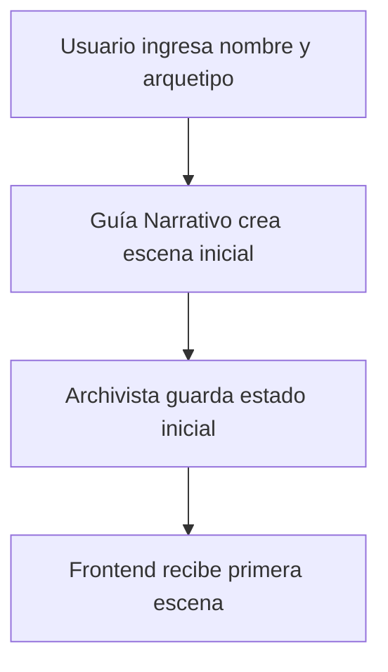
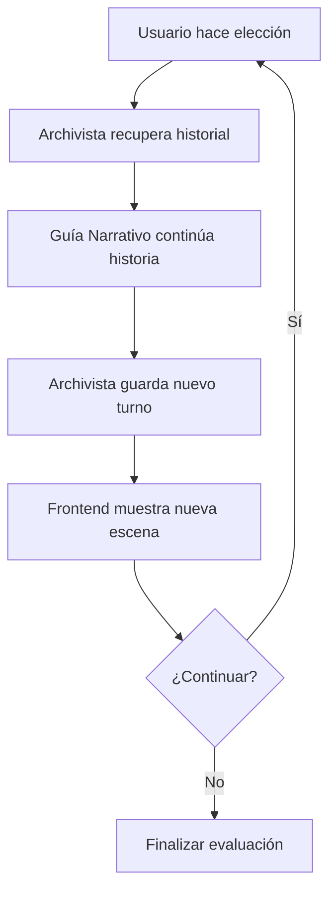
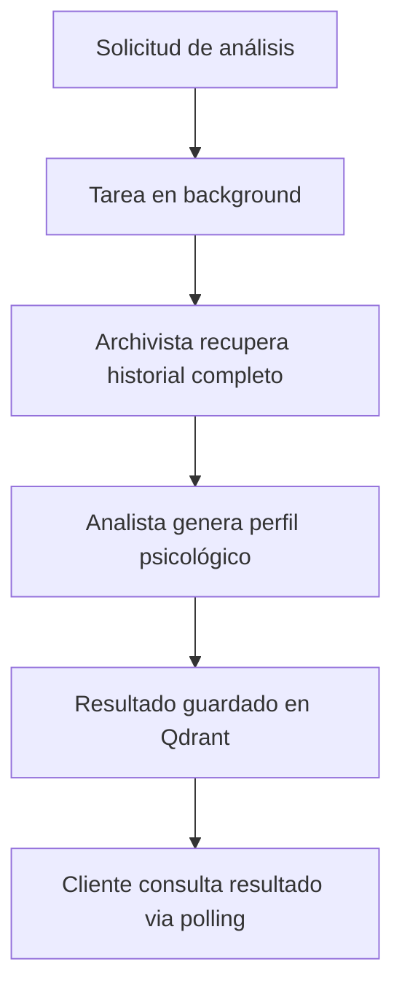

# 📚 Documentación Técnica - Test de Personalidad Interactivo

## 🎯 Resumen Ejecutivo

El **Test de Personalidad Interactivo** es una aplicación web gamificada que utiliza inteligencia artificial multi-agente para evaluar la personalidad de los usuarios a través de narrativas interactivas. El sistema combina storytelling dinámico con análisis psicológico basado en las tipologías Myers-Briggs.

### Características Principales
- **IA Multi-Agente**: Sistema de 3 agentes especializados usando CrewAI
- **Procesamiento Asíncrono**: Análisis en background para mejor UX
- **Base de Datos Vectorial**: Almacenamiento eficiente con Qdrant
- **Interfaz Moderna**: Frontend responsive con Next.js y TypeScript

## 🏗️ Arquitectura del Sistema

### Diagrama de Arquitectura
```
┌─────────────────┐    ┌─────────────────┐    ┌─────────────────┐
│   Frontend      │    │    Backend      │    │  Infraestructura│
│   (Next.js)     │◄──►│   (FastAPI)     │◄──►│    (Docker)     │
│                 │    │                 │    │                 │
│ • React 18      │    │ • CrewAI        │    │ • Qdrant DB    │
│ • TypeScript    │    │ • Mistral AI    │    │ • Vector Store │
│ • Tailwind CSS  │    │ • Python 3.13   │    │ • Compose       │
└─────────────────┘    └─────────────────┘    └─────────────────┘
```

### Flujo de Datos
```
Usuario → Frontend → API Gateway → Agentes IA → Qdrant → Análisis → Resultado
```

## 🤖 Sistema Multi-Agente

### Agente 1: Guía Narrativo
**Rol**: Creador de historias interactivas
- **Modelo**: Mistral Small Latest
- **Función**: Genera escenarios narrativos con opciones de decisión
- **Salida**: JSON con descripción, opciones y palabra simbólica
- **Límites**: 1500 tokens, 3 iteraciones máximo

```python
guia_narrativo = Agent(
    role='Guía de Cuentacuentos Interactivo y Empático',
    goal="Crear cuentos proyectivos breves y evocadores",
    backstory="Narrador sabio que revela el mundo interior",
    llm=llm,
    max_iter=3
)
```

### Agente 2: Analista Psicológico
**Rol**: Especialista en análisis de personalidad
- **Modelo**: Mistral Small Latest
- **Función**: Analiza patrones de decisión y genera perfiles Myers-Briggs
- **Salida**: Perfil psicológico completo con fortalezas y áreas de crecimiento
- **Especialización**: Tipologías E/I, N/S, T/F, J/P

```python
analista_psicologico = Agent(
    role="Psicólogo IA especializado en Análisis Narrativo",
    goal="Analizar patrones de comportamiento y personalidad",
    backstory="IA entrenada en psicología y literatura",
    llm=llm,
    max_iter=3
)
```

### Agente 3: Archivista de Recuerdos
**Rol**: Gestor de datos y memoria del juego
- **Modelo**: Mistral Small Latest
- **Función**: Almacena y recupera historial de partidas
- **Herramientas**: Integración directa con Qdrant
- **Responsabilidad**: Persistencia de datos y recuperación de contexto

```python
archivista_de_recuerdos = Agent(
    role='Guardián de la Memoria del Cuento',
    goal="Guardar y recuperar historial de partidas",
    tools=[save_game_state_to_qdrant, retrieve_game_history],
    llm=llm,
    max_iter=3
)
```

## 🔄 Flujo de Trabajo (Workflow)

### 1. Inicialización del Juego


### 2. Ciclo de Juego


### 3. Análisis Final (Asíncrono)


## 📡 API Endpoints

### Iniciar Juego
```http
POST /iniciar_juego
Content-Type: application/json

{
  "nombre": "string",
  "arquetipo_inicial": "string"
}
```

**Respuesta:**
```json
{
  "game_id": "uuid",
  "descripcion_escena": "string",
  "opciones": [
    {
      "accion": "string",
      "faceta": "string"
    }
  ],
  "palabra_simbolica": "string"
}
```

### Jugar Turno
```http
POST /jugar_turno
Content-Type: application/json

{
  "game_id": "string",
  "eleccion": "string"
}
```

### Finalizar Evaluación (Asíncrono)
```http
POST /finalizar_evaluacion
Content-Type: application/json

{
  "game_id": "string"
}
```

**Respuesta:**
```json
{
  "game_id": "string",
  "status": "processing",
  "message": "El análisis está en proceso"
}
```

### Obtener Resultado (Polling)
```http
GET /obtener_resultado/{game_id}
```

**Respuestas:**
- **En proceso**: `{"status": "processing"}`
- **Completado**: `{"status": "completed", ...perfil_completo}`

## 🗄️ Modelo de Datos

### Estructura de Juego
```typescript
interface GameData {
  game_id: string;
  descripcion_escena: string;
  opciones: Opcion[];
  palabra_simbolica: string;
}

interface Opcion {
  accion: string;
  faceta?: string;
}
```

### Perfil Psicológico
```typescript
interface ProfileData {
  tipo_personalidad: string;
  titulo: string;
  descripcion: string;
  fortalezas: ItemFortaleza[];
  areas_de_crecimiento: ItemArea[];
  mensaje_final: string;
}
```

### Almacenamiento en Qdrant
- **Colección**: `historial_juego_terror`
- **Vectores**: Embeddings de decisiones y contexto
- **Metadatos**: game_id, timestamp, tipo de dato
- **Consultas**: Recuperación por game_id y análisis de patrones

## ⚡ Optimizaciones de Rendimiento

### Cambios Implementados
| Aspecto | Antes | Después | Mejora |
|---------|-------|---------|--------|
| Modelo IA | mistral-medium-latest | mistral-small-latest | 3-5x más rápido |
| Procesamiento | Síncrono | Asíncrono | Sin bloqueos |
| Tokens | Sin límite | 1500 max | Respuestas concisas |
| Iteraciones | Sin límite | 3 max | Mayor velocidad |
| Logging | Verbose | Silencioso | Mejor rendimiento |

### Arquitectura Asíncrona
```python
def generar_analisis_background(game_id: str):
    """Ejecuta el análisis en background"""
    resultado_final = analysis_crew.kickoff(inputs=inputs)
    perfil_data = parser.parse(str(resultado_final))
    save_analysis_result(game_id, perfil_data)

@app.post("/finalizar_evaluacion")
def finalizar_evaluacion(final_input: FinalizeInput, background_tasks: BackgroundTasks):
    background_tasks.add_task(generar_analisis_background, final_input.game_id)
    return {"status": "processing"}
```

## 🔧 Configuración Técnica

### Variables de Entorno (Backend)
```env
MISTRAL_API_KEY=tu_clave_api_mistral
QDRANT_HOST=localhost
QDRANT_PORT=6333
QDRANT_URL=http://localhost:6333
QDRANT_API_KEY=
MAX_TOKENS=1500
MAX_ITERATIONS=3
TEMPERATURE=0.7
```

### Configuración de Mistral AI
```python
llm = ChatMistralAI(
    model_name="mistral-small-latest",
    api_key=os.getenv("MISTRAL_API_KEY"),
    temperature=0.7,
    max_tokens=1500
)
```

### Configuración de CORS
```python
app.add_middleware(
    CORSMiddleware,
    allow_origins=["*"],
    allow_credentials=True,
    allow_methods=["*"],
    allow_headers=["*"],
)
```

## 🧪 Testing y Debugging

### Comandos de Desarrollo
```bash
# Backend Asíncrono (Recomendado)
cd backend && uv run uvicorn main_async:app --reload --host 0.0.0.0 --port 8000

# Backend Síncrono (Testing)
cd backend && uv run uvicorn main:app --reload --host 0.0.0.0 --port 8000

# Frontend
cd frontend && npm run dev
```

### Verificación de Servicios
```bash
# Verificar Qdrant
curl http://localhost:6333/health

# Verificar API
curl http://localhost:8000/docs

# Verificar Frontend
curl http://localhost:3000
```

### Logs y Monitoreo
```bash
# Logs de Qdrant
docker-compose logs qdrant

# Logs del Backend
cd backend && uv run uvicorn main_async:app --log-level debug

# Verificar tipos TypeScript
cd frontend && npm run type-check
```

## 🔒 Seguridad y Mejores Prácticas

### Gestión de API Keys
- Variables de entorno para credenciales
- Archivo `.env.example` como plantilla
- Exclusión de `.env` en `.gitignore`

### Validación de Datos
```python
class PlayerInput(BaseModel):
    nombre: str
    arquetipo_inicial: str

class PlayerTurnInput(BaseModel):
    game_id: str
    eleccion: str
```

### Manejo de Errores
```python
try:
    perfil_data = parser.parse(str(resultado_final))
    save_analysis_result(game_id, perfil_data)
except Exception as e:
    print(f"Error en análisis background: {e}")
```

## 📊 Métricas y Monitoreo

### KPIs del Sistema
- **Tiempo de respuesta**: < 5 segundos por turno
- **Tiempo de análisis**: 2-5 segundos + background processing
- **Precisión del análisis**: Basado en 16 tipos Myers-Briggs
- **Disponibilidad**: 99.9% uptime objetivo

### Métricas de Rendimiento
```python
# Límites de recursos por agente
max_iter=3          # Máximo 3 iteraciones
max_tokens=1500     # Máximo 1500 tokens
temperature=0.7     # Balance creatividad/consistencia
```

## 🚀 Despliegue y Producción

### Configuración Docker
```yaml
services:
  qdrant:
    image: qdrant/qdrant:latest
    ports:
      - "6333:6333"
    mem_limit: 4g
    volumes:
      - ./qdrant_data:/qdrant/storage
```

### Build de Producción
```bash
# Frontend
cd frontend && npm run build

# Backend con UV
cd backend && uv sync --no-dev
```

### Variables de Producción
```env
NODE_ENV=production
MISTRAL_API_KEY=production_key
QDRANT_URL=https://production-qdrant.com
```

## 🔄 Versionado y Actualizaciones

### Versión Actual: v0.1.0
- ✅ Sistema multi-agente implementado
- ✅ Procesamiento asíncrono
- ✅ Optimizaciones de rendimiento
- ✅ Interfaz responsive

### Roadmap Futuro
- [ ] Análisis de sentimientos avanzado
- [ ] Múltiples idiomas
- [ ] Integración con redes sociales
- [ ] Dashboard de administración
- [ ] API de terceros

## 📝 Contribución y Desarrollo

### Estructura de Commits
```
feat: nueva funcionalidad
fix: corrección de bug
docs: actualización de documentación
style: cambios de formato
refactor: refactorización de código
test: adición de tests
```

### Flujo de Desarrollo
1. Fork del repositorio
2. Crear rama feature: `git checkout -b feature/nueva-funcionalidad`
3. Commit cambios: `git commit -am 'feat: agrega nueva funcionalidad'`
4. Push: `git push origin feature/nueva-funcionalidad`
5. Crear Pull Request

## 🆘 Troubleshooting Avanzado

### Problemas Comunes y Soluciones

#### Error de Conexión Qdrant
```bash
# Diagnóstico
docker ps | grep qdrant
docker-compose logs qdrant

# Solución
docker-compose restart qdrant
```

#### Análisis Lento
```bash
# Verificar uso de versión asíncrona
curl -X POST "http://localhost:8000/finalizar_evaluacion"

# Consultar estado
curl "http://localhost:8000/obtener_resultado/game-id"
```

#### Error de Parsing JSON
```python
# Verificar formato de salida del LLM
try:
    perfil_data = parser.parse(str(resultado_final))
except json.JSONDecodeError:
    # Log del raw output para debugging
    print(f"Raw output: {str(resultado_final)}")
```

## 📚 Referencias y Recursos

### Documentación Técnica
- [CrewAI Documentation](https://docs.crewai.com/)
- [FastAPI Documentation](https://fastapi.tiangolo.com/)
- [Qdrant Documentation](https://qdrant.tech/documentation/)
- [Mistral AI API](https://docs.mistral.ai/)

### Recursos de Psicología
- [Myers-Briggs Type Indicator](https://www.myersbriggs.org/)
- [Psychological Assessment Theory](https://psycnet.apa.org/)

### Herramientas de Desarrollo
- [UV Package Manager](https://github.com/astral-sh/uv)
- [Next.js Documentation](https://nextjs.org/docs)
- [TypeScript Handbook](https://www.typescriptlang.org/docs/)

---

**Desarrollado con ❤️ para la hackathon**  
*Documentación técnica v1.0 - Última actualización: 2024*